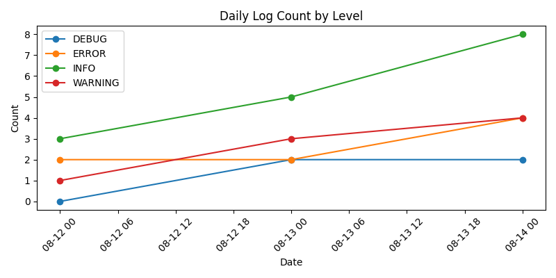

# Log Analysis Portfolio



Python（pandas / matplotlib）でのログ解析サンプルです。  
**CSV読み込み → 条件抽出 → 可視化**までを最小構成で再現できます。

## 実務での応用例
- サーバーログやアプリケーションログからのエラートレンド分析
- 障害検知前の事前可視化やKPI監視の基礎処理
- ログレベル別の発生傾向比較による品質改善分析

---

## Features
- CSV読み込み・前処理（pandas）
- ERRORログ抽出・時系列ソート
- 日別件数の棒グラフ出力
- ログレベル別の時系列比較

---

## プロジェクト構成
```plaintext
log-analysis-portfolio/
├─ README.md
├─ LICENSE
├─ requirements.txt
├─ src/         # 解析スクリプト
│  ├─ read_csv.py
│  ├─ filter_error.py
│  ├─ daily_plot.py
│  └─ level_timeseries.py
├─ data/        # サンプルデータ
│  └─ log_sample.csv
├─ docs/        # 出力ファイルサンプル
│  └─ daily_log_by_level.png
├─ output/      # 生成物（例：グラフPNG）
└─ scripts/     # 実行用スクリプト
   ├─ run_all.sh
   └─ run_all.bat
```

---

## Quick Start

このプロジェクトは **自動セットアップ** と **手動セットアップ** の2パターンで実行できます。  
初めて触る方や動作確認だけの場合は自動セットアップがおすすめです。

### 1. 自動セットアップ（WSL / Linux / Mac 推奨）
依存関係インストール〜実行まで1コマンドで行います。
```bash
# Clone
git clone https://github.com/anko294/log-analysis-portfolio.git
cd log-analysis-portfolio

# Run (venv作成 + requirementsインストール + 実行)
bash scripts/run_all.sh
```
> 初回は依存関係のインストールがあるため、数十秒かかる場合があります。

---

### 1-2. 自動セットアップ（Windows ネイティブ）
Windows環境の場合は、PowerShell またはエクスプローラーから以下のバッチを実行してください。
```powershell
# Clone
git clone https://github.com/anko294/log-analysis-portfolio.git
cd log-analysis-portfolio

# Run
scripts\run_all.bat
```
> 初回実行時は `.venv` の作成と依存パッケージのインストールを自動で行います。  
> 実行後、`output/` に生成物が出力されます。

---

### 2. 手動セットアップ（環境を自分で管理したい場合）
```bash
# Clone
git clone https://github.com/anko294/log-analysis-portfolio.git
cd log-analysis-portfolio

# 仮想環境（任意）
python3 -m venv .venv
source .venv/bin/activate

# 依存関係インストール
pip install -r requirements.txt

# 実行
bash scripts/run_all.sh
```

---

## 入出力
- 入力: `data/log_sample.csv`  
- 出力:  
  - `output/error_log_daily.png`（日別ERROR件数の棒グラフ）  
  - `output/daily_log_by_level.png`（ログレベル別の折れ線グラフ）

---

## Notes
- Windowsネイティブ環境で動かす場合は、WSL または Git Bash を使用することを推奨します。
- `scripts/run_all.sh` 実行時に `.venv` が存在しない場合は自動的に作成されます。
- 依存パッケージを固定したい場合は以下で `requirements.lock.txt` が生成されます。
```bash
LOCK=1 bash scripts/run_all.sh
```
---

## License
MIT License
